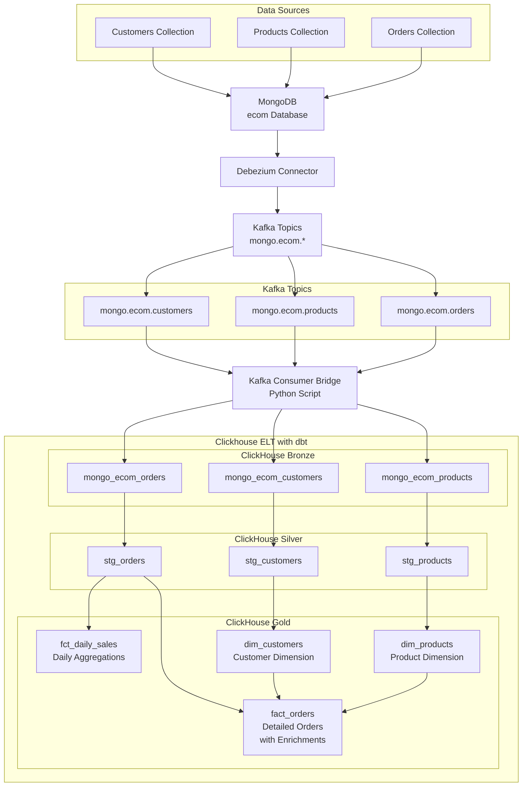

# Change Data Capture (CDC) Project

A complete end-to-end Change Data Capture pipeline that streams data from MongoDB through Kafka to ClickHouse, with dbt transformations for analytics.

## 🏗️ Data Architecture

This project implements a modern data architecture following the **Bronze → Silver → Gold** pattern:

### Data Flow Overview
```
MongoDB (Source) 
    ↓ [CDC]
Debezium Connector 
    ↓ [JSON Events]
Kafka Topics 
    ↓ [Stream Processing]
ClickHouse Sink Connector 
    ↓ [Raw JSON Storage]
ClickHouse Bronze Tables 
    ↓ [dbt Transformations]
ClickHouse Silver/Gold Tables
```

### Layer Architecture

**🥉 Bronze Layer (Raw Data)**
- **Purpose**: Store raw, unmodified data from source systems
- **Storage**: ClickHouse tables with JSON strings
- **Tables**: `mongo_ecom_customers`, `mongo_ecom_products`, `mongo_ecom_orders`
- **Data Format**: Raw Debezium CDC events in JSON format

**🥈 Silver Layer (Cleaned Data)**
- **Purpose**: Parsed, cleaned, and typed data ready for analytics
- **Storage**: ClickHouse tables with proper data types
- **Models**: `stg_orders`, `stg_customers`, `stg_products`
- **Transformations**: JSON parsing, data typing, field extraction

**🥇 Gold Layer (Business Metrics)**
- **Purpose**: Aggregated business metrics and KPIs
- **Storage**: ClickHouse fact and dimension tables
- **Models**: `fct_daily_sales`, `dim_customers`, `dim_products`, `fact_orders`
- **Transformations**: Business logic, aggregations, calculations

## 🛠️ Technologies Used

| Component | Technology | Purpose |
|-----------|------------|---------|
| **Source Database** | MongoDB 5.0 | Operational data store with replica set |
| **Change Data Capture** | Debezium 2.1 | Captures database changes in real-time |
| **Message Bus** | Apache Kafka 7.3.0 | Streams CDC events reliably |
| **Stream Processing** | Kafka Connect | Moves data between systems |
| **Data Warehouse** | ClickHouse Latest | Columnar database for analytics |
| **Data Transformation** | dbt Core | SQL-based transformations |
| **Orchestration** | Docker Compose | Container orchestration |

## 📁 Project Structure

```
Change Data Capture Project/
├── README.md                             # Project documentation
├── docker-compose.yml                   # Docker services setup
├── requirements.txt                     # Python dependencies
├── config.template                      # Configuration template
│
├── 🔌 connectors/                        # Kafka Connect Configurations
│   ├── debezium-mongo-source-config.json # MongoDB CDC connector
│   └── clickhouse-sink-config.json      # ClickHouse sink connector
│
├── 🗄️ data-generation/                  # Data Generation Scripts
│   ├── seed_data.py                     # Generates fake e-commerce data
│   └── init-replica-set.js              # MongoDB replica set setup
│
├── 🛠️ scripts/                          # Utility Scripts
│   └── register_connectors.sh           # Deploy connectors script
│
├── 📚 docs/                             # Additional Documentation
│   └── [future documentation]
│
└── 📊 ecom_analytics/                   # dbt Analytics Project
    ├── dbt_project.yml                  # dbt project configuration
    ├── profiles.yml                     # dbt ClickHouse connection
    ├── packages.yml                     # dbt packages
    ├── models/
    │   ├── bronze_sources.yml           # Source table definitions
    │   ├── staging/
    │   │   ├── stg_customers.sql        # Customer staging model
    │   │   ├── stg_products.sql         # Product staging model  
    │   │   ├── stg_orders.sql           # Order staging model
    │   │   └── schema.yml               # Staging model tests
    │   └── marts/
    │       ├── dim_customers.sql        # Customer dimension
    │       ├── dim_products.sql         # Product dimension  
    │       ├── fact_orders.sql          # Detailed orders fact
    │       ├── fct_daily_sales.sql      # Daily sales aggregations
    │       └── schema.yml               # Marts model tests
    └── [other dbt directories]
```

## 🚀 Quick Start

### Prerequisites

- **Docker & Docker Compose** - For running the infrastructure
- **Python 3.8+** - For data generation scripts
- **PowerShell** (Windows) or bash (Linux/macOS) - For running commands
- **dbt Core & dbt-clickhouse** - For data transformations (install via requirements.txt)

### 1. Start the Infrastructure

```powershell
# Start all services (MongoDB, Kafka, ClickHouse, Kafka Connect)
docker-compose up -d

# Wait for services to initialize (about 30 seconds)
Start-Sleep -Seconds 30

# Check service status - all 5 services should be "Up"
docker-compose ps
```

**⚠️ Important**: If Kafka fails to start, check the logs with `docker-compose logs kafka` and ensure the listener configuration is correct.

### 2. Install Python Dependencies

```powershell
# Install all required Python packages
pip install -r requirements.txt

# If confluent-kafka has compilation issues, use pre-compiled wheels:
# pip install --only-binary=all confluent-kafka
```

### 3. Initialize MongoDB Replica Set

```powershell
# Copy the initialization script to MongoDB container
docker cp data-generation/init-replica-set.js mongo:/tmp/init-replica-set.js

# Initialize replica set (required for CDC)
docker exec -it mongo mongosh --file /tmp/init-replica-set.js
```

### 4. Deploy Debezium Source Connector

```powershell
# Test if Kafka Connect is ready
curl http://localhost:8083/

# Register Debezium MongoDB source connector
Invoke-WebRequest -Uri "http://localhost:8083/connectors" -Method POST -ContentType "application/json" -InFile "connectors/debezium-mongo-source-config.json"

# Check connector status (should show "RUNNING")
Invoke-WebRequest -Uri "http://localhost:8083/connectors/debezium-mongo-source/status" | Select-Object -ExpandProperty Content
```

### 5. Generate Sample Data

```powershell
# Generate fake e-commerce data (this will trigger CDC events)
python data-generation/seed_data.py
```

### 6. Verify CDC Data Flow

```powershell
# Check Kafka topics were created by Debezium
docker-compose exec kafka kafka-topics --list --bootstrap-server localhost:9092

# Verify CDC data is flowing to Kafka (single line for PowerShell)
docker-compose exec kafka kafka-console-consumer --bootstrap-server localhost:9092 --topic mongo.ecom.ecom.orders --from-beginning --max-messages 5

# Check ClickHouse is running
docker-compose exec clickhouse clickhouse-client -q "SELECT 1"
```

**🎉 Success**: You should see:
- Kafka topics: `mongo.ecom.ecom.customers`, `mongo.ecom.ecom.products`, `mongo.ecom.ecom.orders`
- JSON messages in the Kafka consumer showing MongoDB changes with order data, line items, and customer IDs
- ClickHouse responding with "1"

### 7. Load Data into ClickHouse (Kafka Consumer Bridge)

Since the automated ClickHouse sink connector has installation issues, we use a custom Kafka consumer bridge:

#### Option A: Reset and Load Fresh Data (Start Here)
```powershell
# Clear ClickHouse data and reload from Kafka beginning (filters out delete events)
python scripts/kafka_to_clickhouse_bridge.py --reset
```

#### Option B: Real-time Streaming Pipeline (Recommended)
```powershell
# Start the real-time CDC pipeline (runs continuously)
python scripts/kafka_to_clickhouse_bridge.py --realtime

# This will run continuously, processing new CDC events as they arrive
# Press Ctrl+C to stop when done testing
```

#### Option C: One-time Batch Processing  
```powershell
# Run once to process existing messages and exit
python scripts/kafka_to_clickhouse_bridge.py --batch
```

#### Verify Data Loading
```powershell
# Check data counts in ClickHouse
docker-compose exec clickhouse clickhouse-client -q "SELECT COUNT(*) as customers FROM mongo_ecom_customers; SELECT COUNT(*) as products FROM mongo_ecom_products; SELECT COUNT(*) as orders FROM mongo_ecom_orders;"
```

**🎉 Success**: You should see:
- Customer records: 150+ rows (real customer data with names, emails)
- Product records: 300+ rows (real product data with names, prices)
- Order records: 600+ rows (real orders with line items)

**Reset Mode**: Clears ClickHouse tables and reloads from Kafka beginning, filtering out delete events to ensure only real data is loaded.

**Real-time Mode**: The bridge runs continuously, processing new CDC events as they arrive. This creates a true streaming data pipeline.

**Batch Mode**: Processes existing messages and exits. Useful for initial data loading or periodic batch jobs.

**⚠️ Note**: If you see `{"__deleted":true}` data, use the `--reset` option to clear and reload with real data.

### 8. Run dbt Transformations

Now that we have CDC data in ClickHouse, run the complete transformation pipeline:

```powershell
cd ecom_analytics

# Install dbt packages
dbt deps

# Test dbt connection to ClickHouse
dbt debug

# Run the complete data transformation pipeline
dbt run

# Run data quality tests
dbt test

cd ..
```

**🎉 Success**: You should see:
- Bronze sources recognized (mongo_ecom_customers, mongo_ecom_products, mongo_ecom_orders)
- Silver staging models created (stg_customers, stg_products, stg_orders)  
- Gold marts created (dim_customers, dim_products, fact_orders, fct_daily_sales)
- All tests passing

### 🎯 Complete Pipeline Overview

**Congratulations!** You now have a fully working end-to-end CDC pipeline:

```
MongoDB (Source) 
    ↓ [CDC]
Debezium Connector 
    ↓ [JSON Events]
Kafka Topics 
    ↓ [Stream Processing]
Kafka Consumer to ClickHouse Bridge
    ↓ [Raw JSON Storage]
ClickHouse Bronze Tables 
    ↓ [dbt Transformations]
ClickHouse Silver/Gold Tables
```

**Key Components:**
- **MongoDB**: Source database with e-commerce data (customers, products, orders)
- **Debezium**: Captures database changes and streams to Kafka
- **Kafka**: Message broker storing CDC events as JSON
- **Bridge Script**: Manual consumer that loads Kafka data into ClickHouse
- **ClickHouse**: Analytical database storing raw and transformed data
- **dbt**: SQL-based transformation tool creating analytics-ready tables

**What you can do now:**
- 📊 **Query analytics data**: Use ClickHouse SQL to analyze customer behavior, sales trends
- 🔄 **Add new data**: Insert records into MongoDB and watch them flow through Kafka
- 🧪 **Test CDC**: Update/delete MongoDB records to see change events
- 📈 **Build dashboards**: Connect BI tools to ClickHouse Gold tables
- 🔧 **Customize models**: Modify dbt models for your specific analytics needs

## Linux/macOS Alternative Commands

If you're on Linux or macOS, replace PowerShell commands with bash equivalents:

```bash
# Use curl instead of Invoke-WebRequest
curl -X POST -H "Content-Type: application/json" --data @connectors/debezium-mongo-source-config.json http://localhost:8083/connectors

# Use sleep instead of Start-Sleep
sleep 30

# Line continuation works with backslashes
docker-compose exec kafka kafka-console-consumer \
  --bootstrap-server localhost:9092 \
  --topic mongo.ecom.ecom.orders \
  --from-beginning \
  --max-messages 5
```

## 📊 Data Architecture Flow Diagram

Here's the detailed data flow through your pipeline:

```
MongoDB (Source) 
    ↓ [CDC]
Debezium Connector 
    ↓ [JSON Events]
Kafka Topics 
    ↓ [Stream Processing]
Kafka Consumer to ClickHouse Bridge
    ↓ [Raw JSON Storage]
ClickHouse Bronze Tables 
    ↓ [dbt Transformations]
ClickHouse Silver/Gold Tables
```

**Note**: This pipeline uses a **manual Kafka consumer bridge** instead of the automated ClickHouse sink connector due to installation/compatibility issues.



## 🔧 Configuration Details

### MongoDB Configuration
- **Replica Set**: `rs0` (required for Change Streams)
- **Port**: 27017
- **Database**: `ecom`
- **Collections**: `customers`, `products`, `orders`

### Kafka Configuration
- **Bootstrap Server**: `localhost:9092`
- **Zookeeper**: `localhost:2181`
- **Topic Prefix**: `mongo.ecom`
- **Replication Factor**: 1 (development)

### ClickHouse Configuration
- **HTTP Port**: 8123
- **Native Port**: 9000
- **Database**: `default`
- **User**: `default` (no password)

### dbt Configuration
- **Profile**: `clickhouse_project`
- **Target**: `dev`
- **Schema**: `default`

## 📈 Sample Queries

### Bronze Layer - Raw Data
```sql
-- View raw Debezium events
SELECT raw_data 
FROM mongo_ecom_orders 
LIMIT 1;
```

### Silver Layer - Parsed Data
```sql
-- View cleaned orders
SELECT order_id, customer_id, ordered_at, order_status
FROM stg_orders
LIMIT 10;
```

### Gold Layer - Business Metrics

#### Customer Dimension
```sql
-- Customer segmentation analysis
SELECT 
    customer_segment,
    COUNT(*) as customer_count,
    AVG(days_since_registration) as avg_days_registered
FROM dim_customers
GROUP BY customer_segment
ORDER BY customer_count DESC;
```

#### Product Dimension
```sql
-- Product inventory and pricing analysis
SELECT 
    price_category,
    inventory_status,
    COUNT(*) as product_count,
    AVG(price) as avg_price
FROM dim_products
GROUP BY price_category, inventory_status
ORDER BY price_category, inventory_status;
```

#### Comprehensive Order Facts
```sql
-- Detailed order analysis with customer and product info
SELECT 
    order_date,
    customer_name,
    customer_segment,
    product_name,
    price_category,
    quantity,
    unit_price,
    line_total,
    order_total_value,
    customer_lifetime_value
FROM fact_orders
WHERE order_date >= subtractDays(today(), 7)
ORDER BY order_total_value DESC
LIMIT 20;
```

#### Daily Sales Aggregations
```sql
-- Daily sales performance
SELECT 
    order_date,
    total_revenue,
    total_orders_placed,
    total_unique_customers,
    avg_order_value
FROM fct_daily_sales
ORDER BY order_date DESC
LIMIT 7;
```

## 🔍 Monitoring & Troubleshooting

### Check Connector Status
```bash
# List all connectors
curl http://localhost:8083/connectors

# Check specific connector status
curl http://localhost:8083/connectors/debezium-mongo-source/status
curl http://localhost:8083/connectors/clickhouse-ecom-sink/status
```

### View Kafka Messages
```bash
# Consume messages from orders topic
docker-compose exec kafka kafka-console-consumer \
  --bootstrap-server localhost:9092 \
  --topic mongo.ecom.orders \
  --from-beginning
```

### ClickHouse Queries
```bash
# Connect to ClickHouse
docker-compose exec clickhouse clickhouse-client

# Check table schemas
DESCRIBE TABLE mongo_ecom_orders;

# Monitor data ingestion
SELECT count(), max(_event_timestamp_ms) FROM stg_orders;
```

## 🎯 Use Cases

This comprehensive data pipeline enables real-time analytics for:

- **📊 Real-time Dashboards**: Live sales metrics and KPIs using `fct_daily_sales`
- **🔔 Alerting**: Anomaly detection on sales patterns and inventory levels
- **📈 Business Intelligence**: Historical trend analysis across customers, products, and orders
- **🎯 Personalization**: Customer segmentation and behavior analysis with `dim_customers`
- **📦 Inventory Management**: Product performance and stock tracking via `dim_products`
- **💰 Financial Reporting**: Detailed revenue analysis using `fact_orders` with enriched customer/product data
- **🛒 Order Analytics**: Comprehensive order analysis including price variance detection
- **👥 Customer Lifetime Value**: Track customer journey and purchasing patterns
- **🏷️ Product Performance**: Analyze product sales by category and pricing tiers

## 🔧 Advanced Setup: Manual ClickHouse Connector

The ClickHouse sink connector requires manual installation. Here are the options:

### Option 1: Manual Data Transfer (Recommended for Testing)
```bash
# Consume from Kafka and manually insert to ClickHouse
docker-compose exec kafka kafka-console-consumer \
  --bootstrap-server localhost:9092 \
  --topic mongo.ecom.orders \
  --from-beginning

# Then manually insert the JSON data into ClickHouse tables
```

### Option 2: HTTP Sink Connector (Alternative)
Use the HTTP sink connector to send data to ClickHouse HTTP interface:
```json
{
  "name": "http-clickhouse-sink",
  "config": {
    "connector.class": "io.confluent.connect.http.HttpSinkConnector",
    "topics.regex": "mongo\\.ecom\\..*",
    "http.api.url": "http://clickhouse:8123/",
    "request.method": "POST"
  }
}
```

### Option 3: Build Custom Connector
Download and build the ClickHouse connector from source:
```bash
# Clone and build the connector
git clone https://github.com/ClickHouse/clickhouse-kafka-connect.git
# Follow build instructions in their repository
```

## 🛡️ Production Considerations

For production deployment, consider:

- **Security**: Enable authentication, SSL/TLS encryption
- **Scalability**: Multi-node Kafka and ClickHouse clusters
- **Monitoring**: Prometheus + Grafana for observability
- **Backup**: Regular backups of ClickHouse data
- **Error Handling**: Dead letter queues and retry policies
- **Schema Evolution**: Proper versioning and migration strategies

## 📚 Additional Resources

- [Debezium Documentation](https://debezium.io/documentation/)
- [Apache Kafka Documentation](https://kafka.apache.org/documentation/)
- [ClickHouse Documentation](https://clickhouse.com/docs/)
- [dbt Documentation](https://docs.getdbt.com/)
- [Kafka Connect Documentation](https://docs.confluent.io/platform/current/connect/)

## 🤝 Contributing

1. Fork the repository
2. Create a feature branch
3. Make your changes
4. Add tests if applicable
5. Submit a pull request

## 📄 License

This project is licensed under the MIT License - see the LICENSE file for details.

---

**Built with ❤️ for real-time data engineering** 